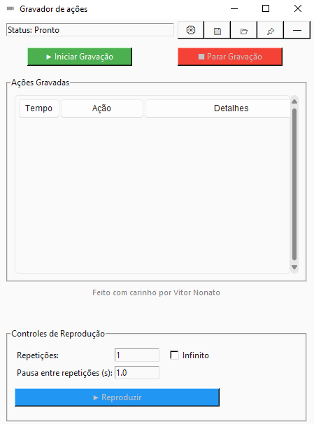
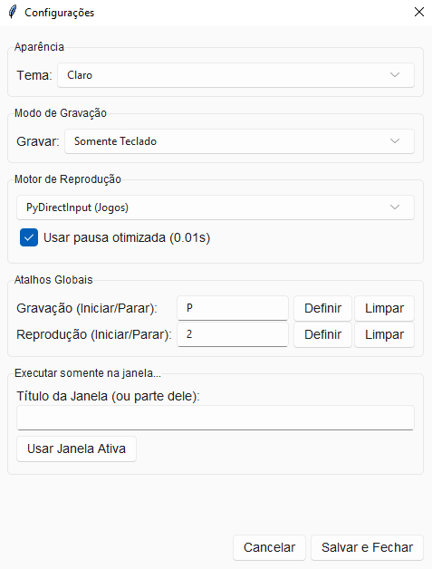

<div align="right">
    <a href="./README.md">🇧🇷 Ler em Português</a>
</div>

<div align="center">
    
    <h1>Advanced Macro Recorder</h1>
</div>

<p align="center">
    A robust desktop application for Windows, developed with Python and Tkinter, that allows recording, playing, and managing keyboard and mouse macros with high precision and customization.
    <br />
    <a href="#key-features"><strong>Explore the Features »</strong></a>
    <br />
</p>

---

## About the Project

This project is a task automation tool (macro) built in Python, using the native **Tkinter** library for the graphical interface. The goal was to create a complete and professional solution with a modular architecture that separates the recording logic, playback, settings management, and the user interface.

The application allows users to record sequences of keyboard and mouse actions and play them back accurately, offering multiple playback engines for compatibility with different types of applications and games. The settings are persistent, saved in a `config.json` file, allowing hotkeys, themes, and other preferences to be maintained across sessions.

### Key Technologies and Concepts

-   **Tkinter (with `ttk`):** Used to build the entire graphical user interface (GUI). The `sv-ttk` library was integrated to provide a modern look and feel, with light and dark themes, similar to the Windows 11 style.
-   **Pynput:** The main library for capturing keyboard and mouse events globally on the operating system. It forms the basis of our recording logic.
-   **Modular Architecture:** The code is organized under `src/` with subfolders for `core` (recording/playback logic), `managers` (handling hotkeys, files, settings), and `ui` (interface components), making the project scalable and easy to maintain.
-   **Multiple Playback Engines:**
    -   **Pynput:** The default engine, ideal for most desktop applications.
    -   **PyAutoGUI:** Offers an alternative for applications that may not respond well to Pynput.
    -   **PyDirectInput:** Especially useful for games, as it simulates events at a lower level.
-   **Configuration Management (`config.json`):** All user preferences, such as the interface theme, global hotkeys, playback engine, and recording mode, are saved in a JSON file, ensuring a personalized and persistent experience.
-   **Threading:** Macro playback is executed in a separate thread to avoid freezing the user interface, allowing the user to stop the execution at any time.

<a name="key-features"></a>

### Key Features

-   **Keyboard and Mouse Recording:** Record key presses, clicks, mouse movements, and scrolling.
-   **Recording Modes:** Choose to record "Keyboard and Mouse," "Keyboard Only," or "Mouse Only."
-   **Playback Control:** Set the number of repetitions, infinite loop, and the pause time between repetitions.
-   **Global Hotkeys:** Configure keyboard shortcuts to start/stop recording and playback from anywhere in the system.
-   **Modern Interface:**
    -   Light and dark themes.
    -   "Mini" mode for discreet control on the screen.
    -   Option to keep the window always on top ("Pin").
-   **Engine Selection:** Switch between Pynput, PyAutoGUI, and PyDirectInput for maximum compatibility.
-   **Window-Specific Execution:** Configure the macro to run only when a specific window is in the foreground.
-   **Save and Load Macros:** Recorded action sequences can be saved to `.json` files and loaded later.

---

### Screenshots

<p align="center">
  
  <br>
  <em>Main application screen.</em>
</p>

<p align="center">
  
  <br>
  <em>Settings screen.</em>
</p>

---

### Getting Started

#### Prerequisites

-   Python 3.x installed on your system
-   `pip` (Python package manager)

#### Installation and Execution

1.  **Clone the repository (or download the files):**
    ```sh
    git clone https://github.com/your-username/your-repository.git
    ```
2.  **Navigate to the project directory:**
    ```sh
    cd teclado
    ```
3.  **Create and activate a virtual environment (recommended):**
    ```sh
    # Windows
    python -m venv venv
    .\venv\Scripts\activate
    ```
4.  **Install the dependencies:**
    ```sh
    pip install -r requirements.txt
    ```
5.  **Run the application:**
    ```sh
    python main.py
    ```
    The main window of the macro recorder will open.

### Author

Developed with ❤️ by **Vitor Nonato Nascimento**.

-   **GitHub:** [https://github.com/NONATO-03](https://github.com/NONATO-03)
