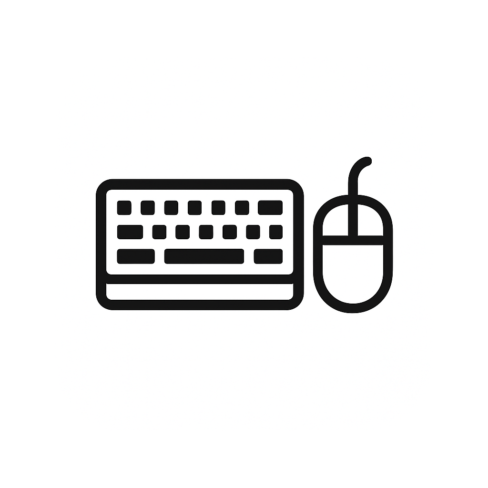

<div align="right">
    <a href="./README.en.md">🇺🇸 Read in English</a>
</div>

<div align="center">
    
    <h1>Gravador de Macro</h1>
</div>

<p align="center">
    Uma aplicação de desktop para Windows, desenvolvida com Python e Tkinter, que permite gravar, reproduzir e gerenciar macros de teclado e mouse com alta precisão e personalização.
    <br />
    <a href="#recursos-principais"><strong>Explore os Recursos »</strong></a>
    <br />
</p>

---

## Sobre o Projeto

Este projeto é uma ferramenta de automação de tarefas (macro) construída em Python, utilizando a biblioteca nativa **Tkinter** para a interface gráfica. O objetivo foi criar uma solução completa e profissional, com uma arquitetura modular que separa a lógica de gravação, reprodução, gerenciamento de configurações e a interface do usuário.

A aplicação permite que os usuários gravem sequências de ações do teclado e do mouse e as reproduzam com precisão, oferecendo múltiplos motores de reprodução para compatibilidade com diferentes tipos de aplicativos e jogos. As configurações são persistentes, salvas em um arquivo `config.json`, permitindo que atalhos, temas e outras preferências sejam mantidos entre as sessões.

### Tecnologias e Conceitos Chave

-   **Tkinter (com `ttk`):** Utilizado para construir toda a interface gráfica do usuário (GUI). A biblioteca `sv-ttk` foi integrada para fornecer um visual moderno, com temas claro e escuro, semelhante ao estilo do Windows 11.
-   **Pynput:** A principal biblioteca para capturar eventos de teclado e mouse de forma global no sistema operacional. É a base da nossa lógica de gravação.
-   **Arquitetura Modular:** O código é organizado em `src/` com subpastas para `core` (lógica de gravação/reprodução), `managers` (gerenciamento de atalhos, arquivos, configurações) e `ui` (componentes da interface), tornando o projeto escalável e de fácil manutenção.
-   **Múltiplos Motores de Reprodução:**
    -   **Pynput:** Motor padrão, ideal para a maioria das aplicações de desktop.
    -   **PyAutoGUI:** Oferece uma alternativa para aplicativos que podem não responder bem ao Pynput.
    -   **PyDirectInput:** Especialmente útil para jogos, pois simula eventos em um nível mais baixo.
-   **Gerenciamento de Configuração (`config.json`):** Todas as preferências do usuário, como o tema da interface, atalhos globais, motor de reprodução e modo de gravação, são salvas em um arquivo JSON, garantindo uma experiência personalizada e persistente.
-   **Threading:** A reprodução das macros é executada em uma thread separada para não congelar a interface do usuário, permitindo que o usuário possa interromper a execução a qualquer momento.

<a name="recursos-principais"></a>

### Recursos Principais

-   **Gravação de Teclado e Mouse:** Grave pressões de teclas, cliques, movimentos e rolagem do mouse.
-   **Modos de Gravação:** Escolha gravar "Teclado e Mouse", "Somente Teclado" ou "Somente Mouse".
-   **Controle de Reprodução:** Defina o número de repetições, loop infinito e o tempo de pausa entre as repetições.
-   **Atalhos Globais:** Configure atalhos de teclado para iniciar/parar a gravação e a reprodução de qualquer lugar do sistema.
-   **Interface Moderna:**
    -   Temas claro e escuro.
    -   Modo "Mini" para um controle discreto na tela.
    -   Opção de manter a janela sempre visível ("Pin").
-   **Seleção de Motor:** Alterne entre Pynput, PyAutoGUI e PyDirectInput para máxima compatibilidade.
-   **Execução em Janela Específica:** Configure a macro para ser executada apenas quando uma janela específica estiver em primeiro plano.
-   **Salvar e Carregar Macros:** As sequências de ações gravadas podem ser salvas em arquivos `.json` e carregadas posteriormente.

---

### Capturas de Tela

<p align="center">
  
  <br>
  <em>Tela principal da aplicação.</em>
</p>

<p align="center">
  
  <br>
  <em>Tela de configurações.</em>
</p>

---

### Como Começar

#### Pré-requisitos

-   Python 3.x instalado no seu sistema
-   `pip` (gerenciador de pacotes do Python)

#### Instalação e Execução

1.  **Clone o repositório (ou baixe os arquivos):**
    ```sh
    git clone https://github.com/seu-usuario/seu-repositorio.git
    ```
2.  **Navegue para o diretório do projeto:**
    ```sh
    cd teclado
    ```
3.  **Crie e ative um ambiente virtual (recomendado):**
    ```sh
    # Windows
    python -m venv venv
    .\venv\Scripts\activate
    ```
4.  **Instale as dependências:**
    ```sh
    pip install -r requirements.txt
    ```
5.  **Execute a aplicação:**
    ```sh
    python main.py
    ```
    A janela principal do gravador de macro será aberta.

### Autor

Desenvolvido com ❤️ por **Vitor Nonato Nascimento**.

-   **GitHub:** [https://github.com/NONATO-03](https://github.com/NONATO-03)
